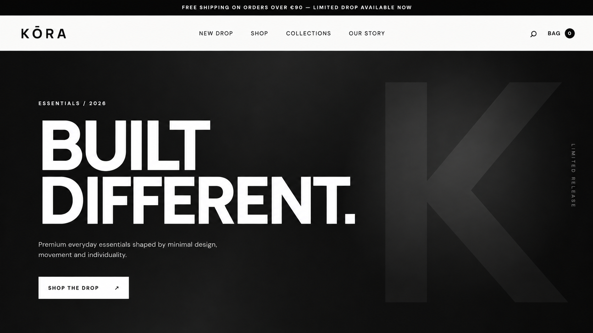
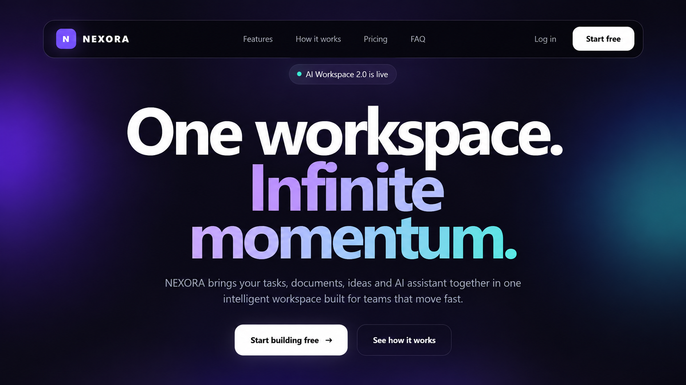

## 🚀 Featured Projects

### KŌRA — Premium E-commerce Storefront
Interactive storefront concept focused on e-commerce UI/UX, product interactions and cart experience.

**Highlights:** Quick View • Size Selection • Cart Drawer • Quantity Controls • Free Shipping Progress

🔗 [Live Demo](https://milenmilanov.github.io/landing-page-portfolio/shopify-storefront/)  
💻 [Source Code](https://github.com/milenmilanov/landing-page-portfolio/tree/main/shopify-storefront)

---

### NEXORA — AI SaaS Landing Page
Modern SaaS interface with dashboard UI, pricing interactions, workflow tabs and responsive frontend behavior.

**Highlights:** SaaS UI • Interactive Pricing • FAQ • Dashboard • Scroll Animations

🔗 [Live Demo](https://milenmilanov.github.io/landing-page-portfolio/saas-landing-page/)  
💻 [Source Code](https://github.com/milenmilanov/landing-page-portfolio/tree/main/saas-landing-page)

---

### NOIR — Fashion Landing Page
Editorial fashion landing page focused on strong visual hierarchy and responsive UI.

**Highlights:** Responsive Design • Product Showcase • Mobile Navigation • Editorial UI

🔗 [Live Demo](https://milenmilanov.github.io/landing-page-portfolio/fashion-landing-page/)  
💻 [Source Code](https://github.com/milenmilanov/landing-page-portfolio/tree/main/fashion-landing-page)

**Tech:** `HTML` `CSS` `JavaScript`

## ⚡ What I Do

- Frontend Development
- Landing Page Development
- UI/UX Design
- Shopify & E-commerce
- Custom Storefront Themes
- Responsive Web Experiences
